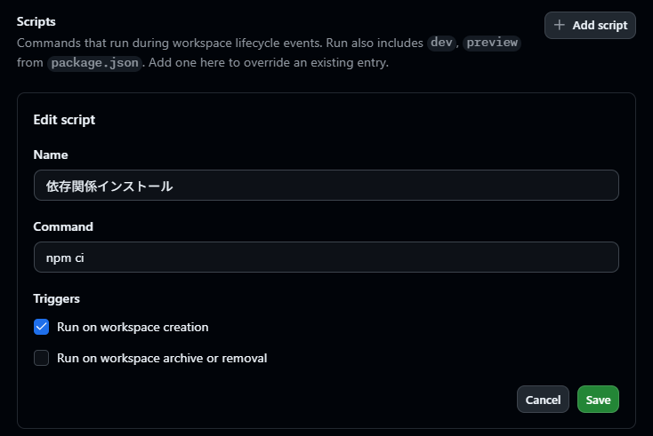
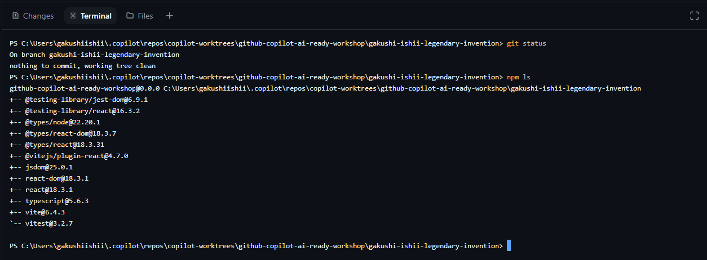

# Lab 00: プロジェクトを準備する

**テーマ:** GitHub Copilot App のセットアップと Preflight

## シナリオ

Fork した Outdoor eShop を GitHub Copilot App にプロジェクトとして登録し、
ワークショップを進められる状態にする。ここは計測対象外の事前準備。

## 前提条件

- GitHub Copilot App が利用できること。
- このリポジトリを自分のアカウントに Fork 済みであること。
- Node.js 20 と npm が利用できること。

## 手順

### 1. Fork したリポジトリをプロジェクトに追加する

プロジェクト一覧で **Add project from → GitHub repository...** を選び、
**自分が Fork したリポジトリ**を追加する。


### 2. Setup スクリプトに `npm ci` を設定する

追加したリポジトリを右クリック → **Settings** → **Scripts** で、Setup スクリプトに次を設定する。

```text
npm ci
```

新しいワークスペース作成時に `package-lock.json` どおりの依存がインストールされる。



### 3. New worktree でセッションを作成する

プロジェクトから新しいセッションを作成し、**New worktree** を選ぶ。
Setup スクリプト完了後、`!` コマンドで状態を確認する。

```text
!git status
```



### 4. Run と Canvas を確認する

右上の **Run** でアプリを起動し、**Browser Canvas** で商品一覧が表示されることを確認する。

## 期待する結果 / 残る成果物

- New worktree のセッションが作成されている。
- Setup スクリプトで依存がインストールされている。
- Run でアプリが起動し、Canvas で表示できる。

> うまくいかない場合は [講師ガイド](./instructor-guide.md#lab-00-復旧) を参照。

---

次へ → [Lab 01: 機能実装でガードレールを体験する](./01-implement-with-guardrails.md)
